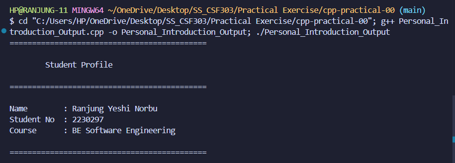
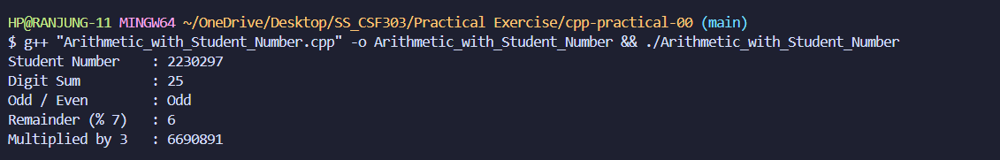
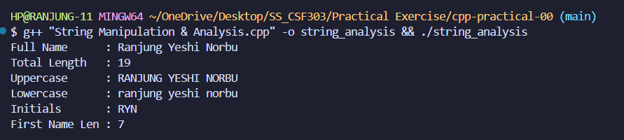
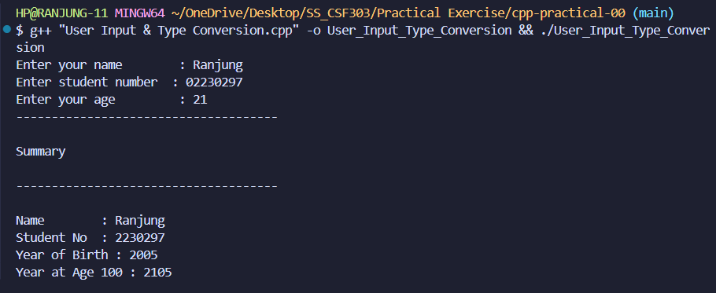
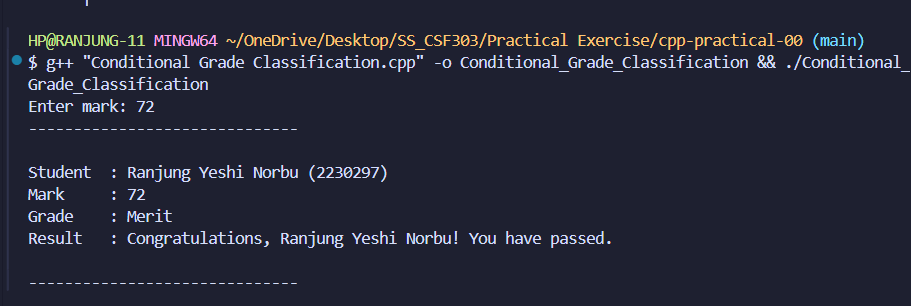
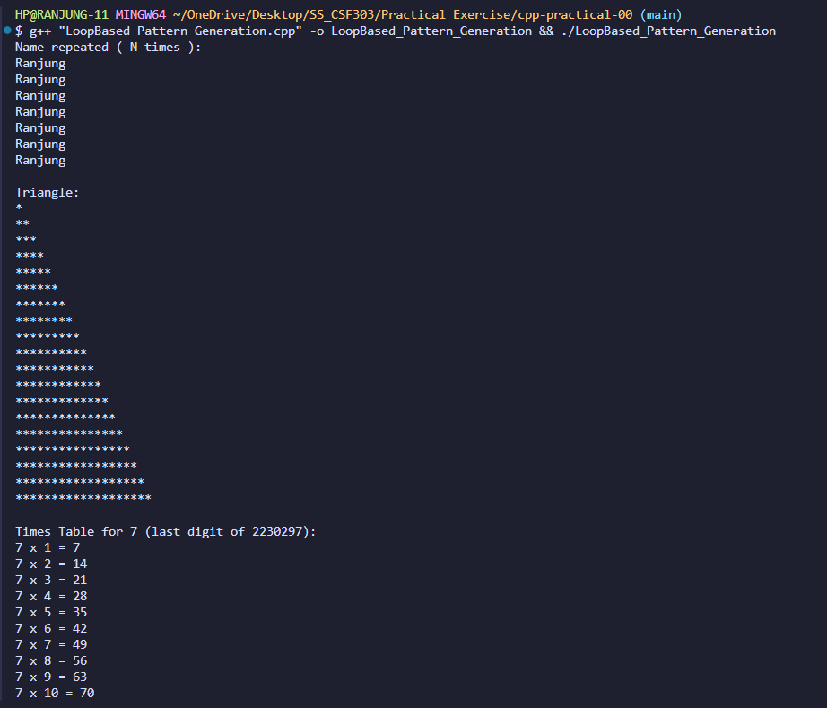
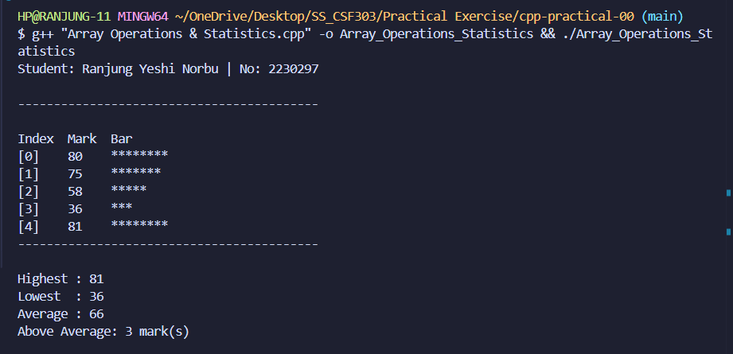
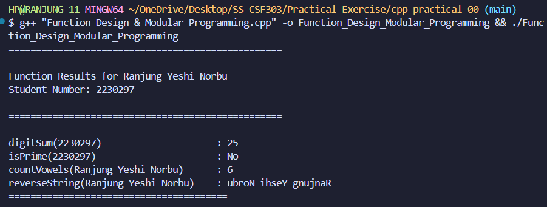
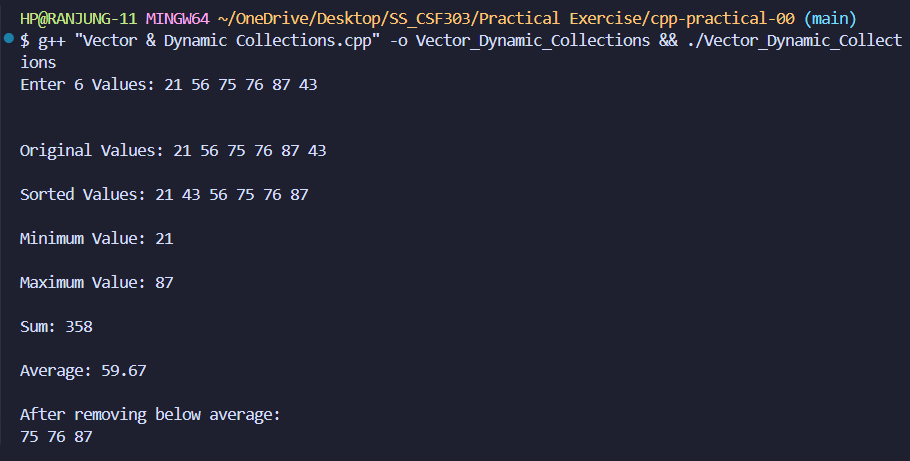
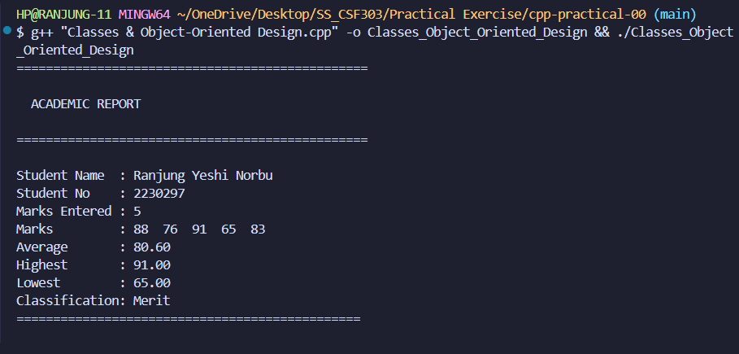

# C++ Programming Fundamentals - Practical Report

## Introduction 

This report is about the practical exercide for the C++ programming fundamentals. It is about the basic concepts of C++ programming language. It covers from the basics covering declaring of variables to functions, classes and object-oriented programming. 

## Program Descriptions

## 1. Personal Introduction Output

**File:** `Personal_Introduction_Output.cpp`

From doing this practical question, I have learned the basics concept of C++ program. I learned how to use `cout` to display the text and also to declare the variables like integer and string and assign values to them. I have also learned how to format the output to make it look neat and presentable.

### Output Screenshot

**Description:** This screenshot shows the output of my personal information. It uses string and integer variables to store data and displays them in a formatted way.

## 2. Arithmetic with Student Number

**File:** `Arithmetic_with_Student_Number.cpp`

This question is about performing the arithmetic operations using my student number. 

Doing this task, I have learned the basic arithmetic operation in C++ like addition, subtraction, multiplication and division and also how to check if a number is odd or even. I have also learned how to use the modulus operator to find the remainder of a division operation.

### Output Screenshot

**Description:** This screenshot shows the output of various arithmetic operations performed on my student number. The program calculates the sum of digits in my student number, checks if the number is odd or even, finds the remainder when divided by 7, and multiplies it by 3. This exercise helped me understand modulus operations and digit extraction.

## 3. String Manipulation & Analysis

**File:** `String Manipulation & Analysis.cpp`

This task is about declaring a string containing our full name and declaring the total character count, converting them into upper and lower case, displaying the initials of the first character form each word and diplaying the length of the first name only.

### Output Screenshots

## 4. User Input & Type Conversion

**File:** `User Input & Type Conversion.cpp`

This exercise question is about taking user input and perform calculations based on the user input.

From doing this question, I have learned how to take user input using `cin` and perform and how to calculate birth year from age and how to predict future years.

### Output Screenshot

**Description:** This output shows how the program takes user input (name, student number, and age) and performs calculations to determine birth year and the year when the person will turn 100 years old. It also demonstrates the use of `cin` for input and basic arithmetic for age calculations.

### 5. Loop-Based Pattern Generation

**File:** `LoopBased Pattern Generation.cpp`

The question is about asking the user to input a mark between 0 and 100 and using if-else statements to classify the marks into different categories in Distinction, Merit, Pass and Fail. 

**Grading System:**
- **75-100:** Distinction
- **60-74:** Merit
- **40-59:** Pass
- **0-39:** Fail

From doing this exercise question, I have learned how to use if-else statements to classify the marks into different categories. I have also learned how to take user input and validate it to ensure that it falls within the specified range. 

The new intresting concept I learned is that to use logical operators (&&, ||) to combine multiple conditions in the if-else statements.

### Output Screenshot

**Description:** This output displays the conditional grade classification system. First the user have to give an input (marks) and based on the marks entered (in this example, let's say 72), the program determines the grade (Merit) and displays whether the student passed or failed. Input validation ensures marks are between 0 and 100.

## 6. Loop-Based Pattern Generation

**File:** `LoopBased Pattern Generation.cpp`

This exercise question is about storing the first name in a string, then using a loop to print the name N times, where N is the number of characters in the name. Using a nested loop, we have to print a right-angled triangle of asterisks where the height equals the number of characters in the full name then print the multiplication table (1 to 10) for the last digit of your student number. 

From doing this exercise question, I have learned how to use loops to repeat actions and how to use nested loops (loops inside loops) to create patterns. I have also learned how to create triangular patterns with stars and how to generate multiplication tables.

### Output Screenshot

**Description:** This demonstrates three different uses of loops:
1. **Name repetition** - My first name "Ranjung" (7 letters) is printed 7 times
2. **Star triangle** - A triangle pattern made of stars with height equal to my full name length (19 rows)
3. **Multiplication table** - Times table for 7 (the last digit of my student number)

### 7. Array Operations & Statistics

**File:** `Array Operations & Statistics.cpp`

The exercise is about declaring an integer array named using the first name with 5 elements. Then populate the array with 5 test marks of our choice (hardcoded). After that need to write code to compute and display: all marks listed with their index, the highest mark, the lowest mark, the average mark, and the number of marks above average. 

Doing this exersie question, I have learned how to declare and initialize arrays in C++. I have also learned how to loop through the array to process each element and find the highest and lowest values. Additionally, I have learned how to calculate the average and count the number of marks above average.

### Output Screenshot

**Description:** This displays a table of 5 marks with visual bar representation (stars). Each mark is displayed with its index, value, and a bar where each star represents 10 marks. The program calculates and displays:
- Highest mark
- Lowest mark
- Average
- Number of marks above average

### 8. Function Design & Modular Programming

**File:** `Function Design & Modular Programming.cpp`

This exercise is about writing functions to perform specific tasks. We have to write a function to calculate the sum of digits in a number, a function to check if a number is prime, a function to count the number of vowels in a name, and a function to reverse a string.

### Implementation of the functions:

I have defined 5 functions:

1. `digitSum(int number)` 

This function takes an integer as input and returns the sum of its digits.

2. `isPrime(int number)`

This function takes an iteger as input and returns a boolean value indicating whether the number is prime or not.

- I have used the return type `bool` to indicate true or false for prime number checking.

3. `countVowels(string name)`

This function takes a string as input and returns the count of vowels (a, e, i, o, u) in the name.

- The logic I used is to loop through each character in the string and check if it is a vowel, incrementing the count accordingly. I have used the `tolower()` function to handle both uppercase and lowercase vowels and used a simple if condition to check for vowels.

4. `reverseString(string str)`

This function takes a string as input that is full name and returns the reversed version of the string.

5. `main()`

In this function it calls the above functions with appropriate arguments and displays the results.

**Functions created:**
- `digitSum()` - calculates sum of digits
- `isPrime()` - checks if a number is prime
- `countVowels()` - counts vowels in a name
- `reverseString()` - reverses a string

**What I learned:**
Doing this exercise question, I have learned how to define functions with parameters and return values. I have also learned how to return boolean values (true/false) from a function, which is useful for conditions like checking if a number is prime. Additionally, I have learned how to pass strings and integers to functions and how to break complex problems into smaller, manageable functions to improve code organization and readability. This modular approach allows for easier debugging and maintenance of the code.

### Output Screenshot

**Description:** This shows the output of four different functions working together:
- `digitSum(2230297)` returns 25
- `isPrime(2230297)` checks if the number is prime
- `countVowels("Ranjung Yeshi Norbu")` counts the vowels (a, u, e, i, o, u = 7 vowels)
- `reverseString()` reverses the full name.

This demonstrates modular programming where each task is handled by a separate function.

## 9. Vector & Dynamic Collections

**File:** `Vector & Dynamic Collections.cpp` 

The task is designed to demonstrate the use of C++ STL vectors and common algorithms. We have to use a vector to store integer values, perform sorting, , manipulate them with STL functions, find minimum and maximum values, calculate the sum, and remove values below the average.

Form doing this exercise question, I have learned how to use vectors in C++, which are dynamic arrays that can resize automatically. I have also learned how to use various STL algorithms such as `sort()`, `min_element()`, `max_element()`, and `accumulate()` to perform operations on the vector. Additionally, I have learned how to use lambda functions with `remove_if()` to remove elements based on a condition and how to use `erase()` to actually remove those elements from the vector. Finally, I have learned how to format decimal output using `setprecision()` for better presentation of results.

### Output Screenshot

**Description:** This demonstrates dynamic vector operations:
1. User enters 6 values
2. Program displays original values
3. Values are sorted automatically
4. Minimum and maximum are found
5. Sum and average are calculated
6. Values below average are removed
7. Final vector is displayed

This shows the power of C++ Standard Template Library (STL).

## 10. Classes & Object-Oriented Design

**File:** `Classes & Object-Oriented Design.cpp`

The exercise is about creating a Student class to manage student information and marks. The class should have private member variables for the student's name, student number, and a vector of marks. The class should have public methods to add marks, calculate the average, highest, and lowest marks, determine the classification (Merit/Pass/Fail), and print a formatted academic report.

From doing this exercise question, I have learned how to define a class in C++ with private member variables and public methods. I have also learned how to use constructors to initialize objects and how to create methods that perform calculations based on the data stored in the class. Additionally, I have learned about encapsulation, which is the concept of keeping data private and providing public methods to access and modify that data. Finally, I have learned how to generate formatted reports using the class methods.

**Class features:**
- Stores student name, number, and marks
- Calculates average, highest, and lowest marks
- Determines classification (Merit/Pass/Fail)
- Prints formatted academic report

### Output Screenshot

**Description:** This shows the academic report generated by the Student class. The report includes:
- Student name and number
- All marks entered
- Average mark
- Highest and lowest marks
- Classification based on average (Merit, Pass, or Fail)

This demonstrates encapsulation, where all student-related data and operations are bundled together in one class.

